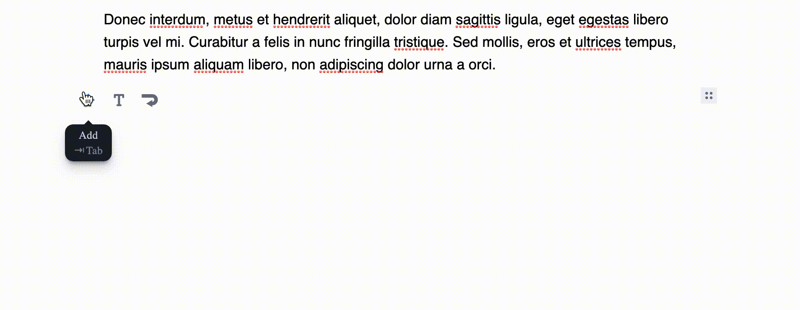

# EditorJS BreakLine Tool


[](https://coveralls.io/github/kommitters/editorjs-break-line)
[](https://bestpractices.coreinfrastructure.org/projects/6467)
[](https://api.securityscorecards.dev/projects/github.com/kommitters/editorjs-break-line)

Break Line and divider Tool for [Editor.js](https://editorjs.io).



## Notes

- Adds an empty block
- Adds a divider block
- Keyboard shortcut `CMD+SHIFT+ENTER`

## Installation

### Install via NPM
Get the package
```shell
$ npm i --save-dev editorjs-break-line
```

Include module at your application

```javascript
import BreakLine from 'editorjs-break-line';
```

### Load from CDN

You can load a specific version of the package from [jsDelivr CDN](https://www.jsdelivr.com/package/npm/editorjs-break-line).

Require this script on a page with Editor.js.

```html
<script src="https://cdn.jsdelivr.net/npm/editorjs-break-line"></script>
```

## Usage

Add a new Tool to the `tools` property of the Editor.js initial config.

```javascript
const editor = EditorJS({
  tools: {
    breakLine: {
      class: BreakLine,
      inlineToolbar: true,
      shortcut: 'CMD+SHIFT+ENTER',
    },
  }
});
```

## Config Params

No config params required.

## Tool's tunes

1. Add a divider line

## Output data

| Field          | Type      | Description                     |
| -------------- | --------- | ------------------------------- |
| divider        | `boolean` | Add a divider line

**Data**

```json
{
  "type": "breakLine",
  "data": {
      "divider": true
  }
},
```

## Development

**Development mode**
```shell
$ yarn build:dev
```

**Production release**
1. Create a production bundle
```shell
$ yarn build
```

2. Commit `dist/bundle.js`

**Run tests**
```shell
$ yarn test
```

## Code of conduct
We welcome everyone to contribute. Make sure you have read the [CODE_OF_CONDUCT][coc] before.

## Contributing
For information on how to contribute, please refer to our [CONTRIBUTING][contributing] guide.

## Changelog
Features and bug fixes are listed in the [CHANGELOG][changelog] file.

## License
This library is licensed under an MIT license. See [LICENSE][license] for details.

## Acknowledgements
Made with 💙 by [kommitters Open Source](https://kommit.co)

[license]: https://github.com/kommitters/editorjs-break-line/blob/master/LICENSE
[coc]: https://github.com/kommitters/editorjs-break-line/blob/master/CODE_OF_CONDUCT.md
[changelog]: https://github.com/kommitters/editorjs-break-line/blob/master/CHANGELOG.md
[contributing]: https://github.com/kommitters/editorjs-break-line/blob/master/CONTRIBUTING.md
